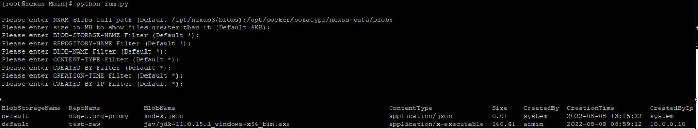

## Nexus Repository Space Utilization Report

This script can be used to generate Nexus Repository manager space utilization report, Which can help to clean up/optimize space utilization.
You can get aa detailed report which shows all the content size in MB, also it is possible to filter the same using using various criteria like Blob Storage Name, Repository Name, Blob Name, Size, Content type, Created By, Creation Time & Created By IP.

## Quick Start

```
git clone https://github.com/shamsher-ansari/nxrm-space-utilization.git
```
```
cd nxrm-space-utilization/Main
```
```
python run.py #Please run with a user who have access to read Nexus blob storage.
```

<strong> This should display below output: </strong>

<!-- logo -->
<p align="center">
  
</p>

## History - The Need

I was try to get some method to find out the Nexus repository utilization by Repository name, Blob Name, Content type, Date/Time, Created By, etc. But could find the same. At last I prepared this script and sharing the same to help out the communituy. Please note that this is a open source script please refer the License in the repository. Hope to add new feature in the script.

## Requirements

* Python 2.x
* Nexus blob storage of course.
* Linux 

## Tested

On CentOS 7 with Python 2.7.5, with Nexus 3.40.1, You may be wondering why I choose Python 2 instead of Python 3. The reason this that the servers I am working on are most CentOS 7 which by default by Python installed and I wanted to keep the requirments as little as possible.

## 💙 Contributing

Have a suggestion? Improvement?

Found a Bug ? Create an Issue.

<br/>


## 💖 Like this project ?

Leave a ⭐ If you think this project is cool.

[Share with the world](https://github.com/shamsher-ansari/nxrm-space-utilization) ✨

<br/>


## 👨‍💻 Author

### Shamsher Ansari

shamsher.ansari5637@gmail.com

<br/>


## 🍁 Licence

**MIT**
